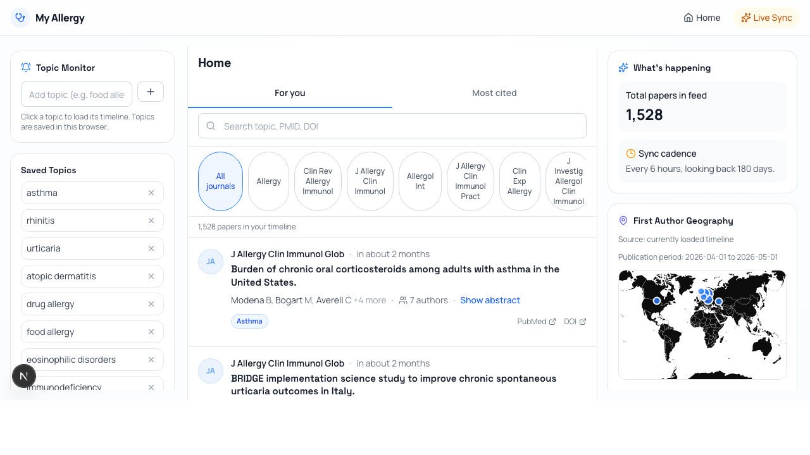

# My Allergy

알레르기/임상면역학 저널 논문을 X(Twitter) 스타일 타임라인으로 모아보는 리서치 포털입니다.
PubMed + CrossRef + Supabase를 기반으로 하루 1회 데이터를 동기화하며, AI 기반 논문 분석과 커뮤니티 기능을 제공합니다.

## 소개

- 대상: 알레르기/면역학 전문 저널 23종 + 종합/호흡기 상위 저널 14종 (총 37종)
- 동기화 주기: 하루 1회 (`vercel.json` cron, 기본)
- 기본 동기화 범위: 최근 365일 (`CRON_SYNC_DAYS`)
- 피드 표시 조건: 초록(abstract)이 있는 논문만 노출
- 정렬: 기본 출간일 최신순, 인용순 정렬 지원
- ClinicalTrials.gov 기반 ongoing trial 모니터 (10개 질환 영역)
- trial 선택 시 관련 intervention / condition 키워드로 논문 타임라인 필터링
- AI Paper Chat: Open Access PDF 기반 Gemini 2.5 Flash 논문 대화
- 커뮤니티: 논문별 익명 댓글 (Agora)

## 스크린샷



## 주요 기능

### 논문 타임라인
- SWR 무한 스크롤 피드
- 저널 태그 필터 / 키워드 검색 (Full-text search)
- 주제 분류 태그 (Asthma, Rhinitis, Urticaria 등)
- 논문 상세 페이지 (초록, 관련/참조/인용 링크, ISR)

### Trending Research Topics
- 탭형 섹션으로 카테고리별 트렌딩 토픽 노출
- 주제 모니터링 (저장/즉시 적용)

### Clinical Trial Monitor
- ClinicalTrials.gov에서 ongoing trial 실시간 조회
- 10개 질환 영역별 탭: Asthma, Food Allergy, Atopic Dermatitis, Allergic Rhinitis, Urticaria, Immunodeficiency, Hypereosinophilia, Chronic Rhinosinusitis, Chronic Urticaria, Anaphylaxis
- Drug pipeline 우선 trial 노출
- trial 선택 시 관련 논문 피드로 즉시 연결되는 상단 active trial filter

### AI Paper Chat
- Open Access PDF 기반 논문 대화 (Gemini 2.5 Flash)
- 4개 소스에서 PDF 자동 탐색 (Unpaywall → PMC → Europe PMC → Semantic Scholar)
- 논문 한계점 분석, Figure 설명 등 구조화된 질의
- 대화 히스토리 저장 + 일일 사용량 제한 (논문당 10회, 일 10논문)
- Excalidraw 기반 연구 Figure 생성

### 커뮤니티 (Agora)
- 논문별 익명 댓글 스레드
- 사용자별 익명 ID (COMMUNITY_SALT 기반)
- 알림 시스템 (답글 알림, 읽지 않은 알림 카운트)

### 사용자 기능
- Supabase Auth 기반 로그인
- 북마크 (서버 동기화)
- AI 초록 요약 (구조화된 한국어 포맷)
- 맞춤 논문 추천 (사용자 친화도 프로필 기반)
- 피드백 수집

### 인사이트
- First Author Geography (세계지도 + 집계)
- Author Leaders

### 학회 캘린더
- 주요 알레르기/면역학 학회 일정
- 국제/국내 분리 타임라인

### 기타
- 다크모드 지원
- 모바일 하단 네비게이션
- 헬스체크 API (`/api/health`)
- GitHub Actions CI (lint → tsc → vitest)

## 기술 스택

- **Framework**: Next.js 16 (App Router, TypeScript, React 19, Turbopack)
- **Database**: Supabase (PostgreSQL + RLS)
- **APIs**: PubMed E-utilities / CrossRef / ClinicalTrials.gov / Gemini 2.5 Flash
- **Styling**: Tailwind CSS v4
- **Queue**: Inngest (per-journal 병렬 동기화 + 개별 재시도)
- **Data fetching**: SWR (infinite scroll, mutation)
- **Testing**: Vitest
- **CI**: GitHub Actions

## 빠른 시작

### 1) 설치

```bash
npm install
```

### 2) 환경변수

`.env.example`을 참고해 `.env.local`을 작성합니다.

```bash
cp .env.example .env.local
```

### 3) Supabase 준비

```bash
brew install supabase/tap/supabase
supabase login
supabase link --project-ref <YOUR_PROJECT_REF>
supabase db push
```

시드 데이터는 다음 중 하나로 적용합니다.

- Supabase Dashboard → SQL Editor에서 `supabase/seed.sql` 실행
- 또는 Supabase CLI seed 설정이 되어 있다면 `supabase db seed`

### 4) 초기 동기화 (선택 권장)

개발 서버 실행 후 수동 동기화를 1회 호출합니다.

```bash
npm run dev
curl -X POST http://localhost:3000/api/sync \
  -H "Authorization: Bearer <CRON_SECRET>"
```

## 로컬 실행

```bash
npm run dev
```

- 앱: `http://localhost:3000`
- 헬스체크: `http://localhost:3000/api/health`

## 배포 방법 (Vercel)

### 1) Vercel 프로젝트 연결

이 저장소를 Vercel에 Import 합니다.

### 2) 환경변수 등록

Vercel Project Settings → Environment Variables에 아래 값 등록:

- `NEXT_PUBLIC_SUPABASE_URL`
- `NEXT_PUBLIC_SUPABASE_ANON_KEY`
- `SUPABASE_SERVICE_ROLE_KEY`
- `CRON_SECRET`
- `CRON_SYNC_DAYS` (권장 `365`)
- `NOTIFICATION_LOOKBACK_HOURS` (권장 `25`)
- `INNGEST_EVENT_KEY`
- `INNGEST_SIGNING_KEY`
- `PUBMED_API_KEY` (선택, 있으면 PubMed rate limit 개선)
- `CROSSREF_EMAIL` (권장)
- `GOOGLE_GENERATIVE_AI_API_KEY` (AI Paper Chat용)
- `COMMUNITY_SALT` (익명 커뮤니티용, 긴 랜덤 문자열)
- `NEXT_PUBLIC_ADSENSE_CLIENT_ID` (선택)
- `NEXT_PUBLIC_ADSENSE_SLOT_FEED` (선택)
- `NEXT_PUBLIC_ADSENSE_SLOT_SIDEBAR` (선택)

### 3) Cron 동기화

`vercel.json`에 아래 스케줄이 포함되어 있습니다.

- `/api/cron/sync-papers`
- `0 0 * * *` (매일 1회, UTC 기준)

`CRON_SECRET`이 설정되어 있으면 cron 요청 인증이 적용됩니다.

### 3-1) GitHub Actions 백업 동기화 (권장)

Vercel cron이 실패해도 하루 1회 동기화를 보장하려면 `.github/workflows/daily-sync-fallback.yml`을 함께 사용하세요.

- 실행 시각: 매일 `01:15 UTC` (KST 10:15)
- 동작: `/api/health` 확인 후 최근 동기화가 20시간 이상 지났을 때만 `/api/sync` 호출
- 필요한 GitHub Secrets:
  - `SYNC_BASE_URL` (예: `https://your-domain.vercel.app`)
  - `CRON_SECRET` (Vercel과 동일한 값)
- 선택 GitHub Variable:
  - `CRON_SYNC_DAYS` (미설정 시 `180`)

### 4) 배포 후 점검

- `GET /api/health`가 `status: ok`인지 확인
- 필요 시 수동 동기화 1회 실행:

```bash
curl -X POST https://<your-domain>/api/sync \
  -H "Authorization: Bearer <CRON_SECRET>"
```

## 테스트

```bash
npm run test
npx tsc --noEmit
```

## 프로젝트 구조

```text
src/
  app/
    page.tsx                  # 메인 타임라인 피드
    login/                    # 로그인
    bookmarks/                # 북마크 목록
    alerts/                   # 키워드 알림 설정
    trending/                 # 트렌딩 피드
    insights/                 # 인사이트 (Author Geography 등)
    calendar/                 # 학회 캘린더
    agora/                    # 커뮤니티 (익명 댓글 피드)
    settings/                 # 사용자 설정
    clinical-trials/          # 임상시험 상세
    paper/[pmid]/             # 논문 상세 (ISR) + AI Chat
    api/
      papers/                 # GET: 페이지네이션 + 필터 + FTS
      papers/[pmid]/          # GET: 단일 논문 조회
      papers/[pmid]/chat/     # POST/GET: AI Paper Chat (Gemini)
      sync/                   # POST: 수동 동기화 트리거
      cron/sync-papers/       # GET: 크론 동기화
      clinical-trials/        # GET: ClinicalTrials.gov 프록시
      topics/trending/        # GET: 트렌딩 토픽
      trending/               # GET: 트렌딩 피드
      bookmarks/              # GET/POST: 북마크 CRUD
      comments/               # GET/POST: 익명 댓글
      agora/                  # GET: Agora 커뮤니티 피드
      chat/                   # GET: 채팅 히스토리/읽지않은 알림
      notifications/          # GET: 알림
      recommendations/        # GET: 맞춤 논문 추천
      feedback/               # POST: 사용자 피드백
      summarize/              # POST: AI 초록 요약
      conferences/            # GET: 학회 일정
      insights/
        author-geography/     # GET: 저자 국가별 집계
        author-leaders/       # GET: 저자 리더보드
      inngest/                # Inngest serve handler
      health/                 # GET: DB 연결 상태 체크
  components/
    layout/                   # header, sidebar, footer, mobile-nav, right-rail
    papers/                   # paper-card, paper-feed, filter-bar, trending 등
    chat/                     # AI Paper Chat UI
    comments/                 # 익명 댓글 스레드
    calendar/                 # conference-list
    maps/                     # author-world-map
    insights/                 # insights-view
    ads/                      # ad-banner
    ui/                       # badge, button, card, input, select, skeleton
  hooks/                      # use-papers, use-auth, use-bookmarks, use-clinical-trials 등
  lib/
    clinical-trials/          # ClinicalTrials.gov 모니터 (10개 질환 영역)
    pubmed/                   # PubMed ESearch/EFetch client + XML parser + OA PDF 탐색
    crossref/                 # DOI 기반 citation count 보강
    gemini/                   # Gemini AI client + PDF 페칭 + 프롬프트
    recommend/                # 사용자 친화도 기반 논문 추천
    comments/                 # 익명 댓글 시스템
    notifications/            # 알림 생성
    auth/                     # Supabase Auth 헬퍼
    inngest/                  # client.ts, functions.ts (queue-based sync)
    sync/                     # orchestrator, fetcher, store, enricher, config
    supabase/                 # client.ts (browser), server.ts (anon + service)
    constants/                # journals (37종), topics, conferences, trending-categories
    utils/                    # cn, date, text, url, retry, rate-limit, topic-tags 등
  types/                      # database.ts (Supabase generated), filters.ts
supabase/
  migrations/                 # 00001~00027
  seed.sql                    # 저널 시드
```
