# My Allergy 사용 설명서

알레르기·임상면역학 전문의·연구자를 위한 My Allergy 사용 가이드입니다.
처음 방문하시는 분이 메인 피드 → 논문 상세 → AI 대화 → 커뮤니티까지 한 흐름으로 이해할 수 있도록 작성했습니다.

> 📘 시스템 설계와 데이터 파이프라인이 궁금하시면 [백서(WHITEPAPER.md)](./WHITEPAPER.md)를 함께 참고하세요.

---

## 목차

1. [한눈에 보기](#1-한눈에-보기)
2. [메인 타임라인](#2-메인-타임라인)
3. [논문 상세 페이지](#3-논문-상세-페이지)
4. [AI Paper Chat](#4-ai-paper-chat)
5. [Trending Research Topics](#5-trending-research-topics)
6. [Clinical Trial Monitor](#6-clinical-trial-monitor)
7. [Agora — 익명 커뮤니티](#7-agora--익명-커뮤니티)
8. [학회 캘린더 / 인사이트](#8-학회-캘린더--인사이트)
9. [사용자 기능 (로그인 후)](#9-사용자-기능-로그인-후)
10. [모바일 사용 가이드](#10-모바일-사용-가이드)
11. [자주 묻는 질문](#11-자주-묻는-질문)

---

## 1. 한눈에 보기

My Allergy는 **알레르기·면역학 37종 저널**의 최신 논문, **ClinicalTrials.gov**의 ongoing 임상시험, 주요 학회 일정을 한 화면에 모아주는 리서치 피드입니다.

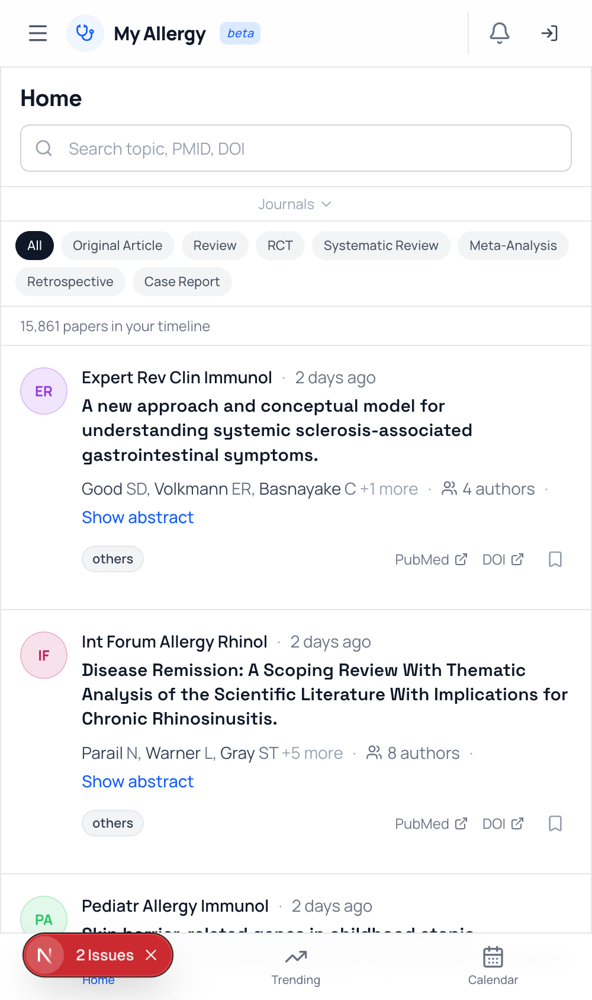

- **왼쪽 사이드바**: 메뉴 (홈, Trending, Trials, Agora, 캘린더, 인사이트)
- **가운데 피드**: 논문 카드 (저널 태그, 제목, 저자, 출간일, 인용수)
- **오른쪽 레일**: 추천 토픽, 진행 중인 임상시험 미리보기

로그인하지 않아도 모든 콘텐츠를 자유롭게 열람할 수 있습니다. 로그인은 **북마크 / AI 요약 / AI 대화 / 커뮤니티 댓글** 사용 시에만 필요합니다.

---

## 2. 메인 타임라인

### 2.1 피드 둘러보기

홈(`/`)은 X(Twitter)와 비슷한 무한 스크롤 피드입니다. 스크롤하면 SWR이 다음 페이지를 자동으로 불러옵니다.

각 카드에서 다음을 한눈에 확인할 수 있습니다.

| 영역 | 표시 정보 |
|---|---|
| 상단 배지 | 저널 이름 (Impact Factor에 따라 색상 부여) |
| 본문 | 논문 제목 + 저자 요약 |
| 메타 | 출간일(상대 시간), DOI 링크, 인용 수 (CrossRef) |
| 액션 | 좋아요(추천), 북마크, AI 요약, 공유 |

### 2.2 필터링

상단 필터바에서 **저널 / 토픽 / 날짜 / 정렬**을 조합할 수 있습니다.

- **저널 필터**: 37개 저널 중 다중 선택. 예) "JACI + JACI:Pract + Allergy"만 보기
- **토픽 태그**: Asthma, Rhinitis, Urticaria, Food Allergy, Atopic Dermatitis 등
- **검색**: 제목·초록 전문(Full-text) 검색. PostgreSQL `tsvector` 기반으로 정확도가 높습니다.
- **정렬**: 기본은 출간일 최신순, "Most cited"로 전환하면 인용수 내림차순.

### 2.3 비로그인 상태

로그인하지 않아도 모든 카드는 그대로 보입니다. 좋아요·북마크·AI 요약 버튼을 누르면 로그인 안내 모달이 뜹니다.

---

## 3. 논문 상세 페이지

카드 본문을 클릭하면 `/paper/[pmid]`로 이동합니다.

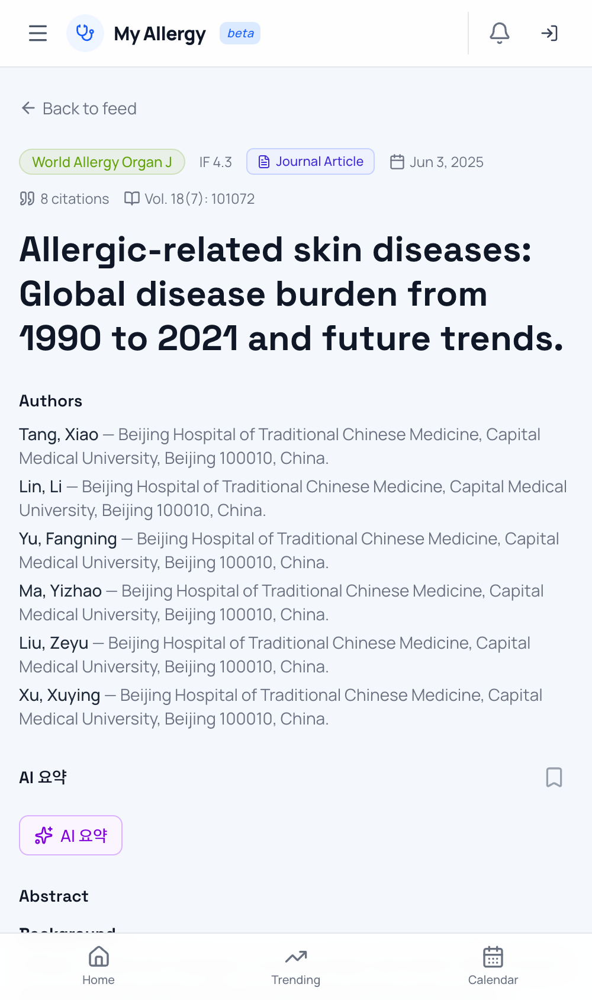

상세 페이지 구성:

1. **헤더** — 저널 배지, 제목, 저자 전체 목록, 출간일, DOI, PubMed 링크
2. **초록(Abstract)** — 원문 그대로
3. **관련 논문** — 같은 토픽·저자·저널 기반 추천
4. **참조 / 인용** — CrossRef 메타에서 가능한 경우 표시
5. **사용자 액션 패널** — 북마크, AI 요약, AI Chat 진입
6. **댓글 스레드 (Agora)** — 익명 댓글 (로그인 필요)

> 🕐 상세 페이지는 ISR로 1시간 단위 캐시됩니다. 새 인용 수·요약은 다음 revalidate 사이클부터 반영됩니다.

---

## 4. AI Paper Chat

논문 상세 페이지의 **"AI와 대화하기"** 버튼을 누르면 Gemini 2.5 Flash 기반 대화가 시작됩니다.

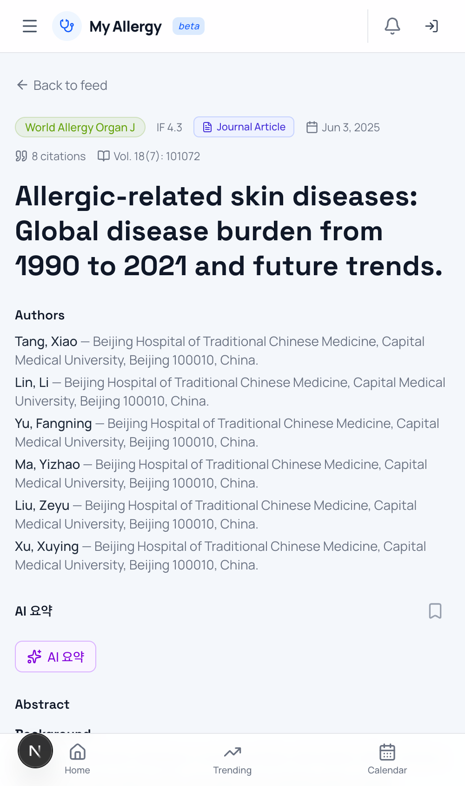

### 4.1 PDF 자동 확보

다음 순서로 무료 PDF를 자동 탐색합니다.

```
Unpaywall → PubMed Central → Europe PMC → Semantic Scholar
```

모두 실패하면 초록만으로 대화하며, UI 상단에 "abstract-only mode" 배지가 표시됩니다.

### 4.2 추천 질문

처음 시작하시면 아래 템플릿이 노출됩니다.

- 📌 이 논문의 핵심 발견과 임상적 의미를 한국어로 요약해줘
- 📌 이 연구의 한계점을 통계·디자인·외적 타당성으로 나눠 분석해줘
- 📌 Figure 2를 임상 의사 관점에서 설명해줘
- 📌 Methods를 표본·디자인·통계검정·윤리로 정리해줘

### 4.3 사용량 한도

- **논문당 10회**까지 질의 가능 (대화 횟수 기준)
- **하루 10개 논문**까지 새 대화 시작 가능
- 한도 초과 시 자정(UTC) 기준으로 리셋

대화 내역은 자동 저장되며, 다시 방문해도 이어서 질의할 수 있습니다.

---

## 5. Trending Research Topics

`/trending`에서 카테고리별 트렌딩 토픽을 확인할 수 있습니다.

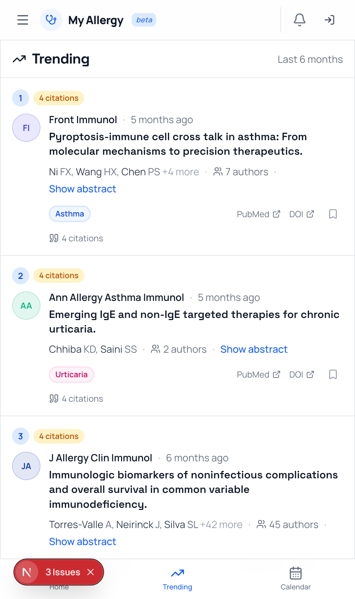

- 탭으로 카테고리를 전환 (Asthma, Atopic Dermatitis, Food Allergy 등)
- 토픽 카드를 클릭하면 해당 키워드로 필터된 논문 피드가 열립니다
- 로그인 후 "구독" 버튼으로 즉시 알림 받기 가능 (예정)

---

## 6. Clinical Trial Monitor

`/clinical-trials`에서 ClinicalTrials.gov 기준 진행 중인 임상시험을 10개 질환 영역으로 모니터링합니다.

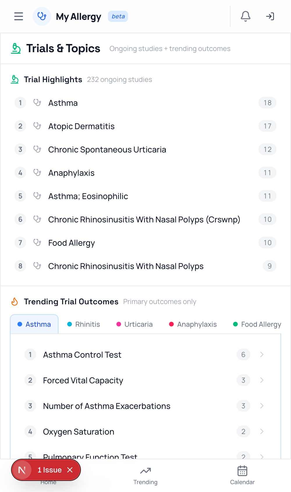

### 6.1 질환 영역 탭

- Asthma / Food Allergy / Atopic Dermatitis / Allergic Rhinitis / Urticaria
- Immunodeficiency / Hypereosinophilia / Chronic Rhinosinusitis / Chronic Urticaria / Anaphylaxis

### 6.2 Drug Pipeline 우선 노출

스폰서·intervention 기준으로 신약 파이프라인 trial을 상단에 배치합니다. 스크롤을 내리면 관찰연구·후속 phase trial이 이어집니다.

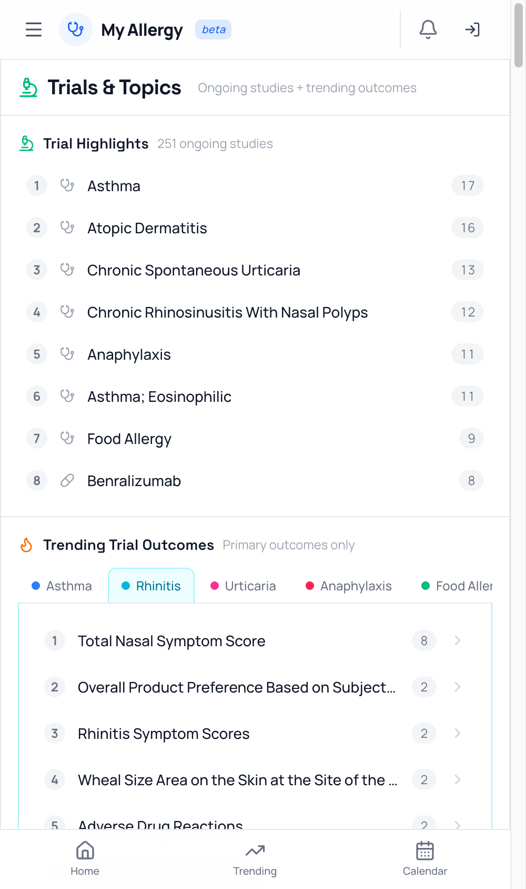

### 6.3 Trial ↔ 논문 양방향 연결

Trial 카드를 클릭하면 해당 trial의 **intervention / condition 키워드**가 메인 피드 상단의 "Active trial filter"로 고정되어, 관련 논문만 필터링됩니다. 다시 클릭하면 필터가 해제됩니다.

---

## 7. Agora — 익명 커뮤니티

`/agora`는 논문별 익명 댓글이 모이는 커뮤니티 탭입니다.

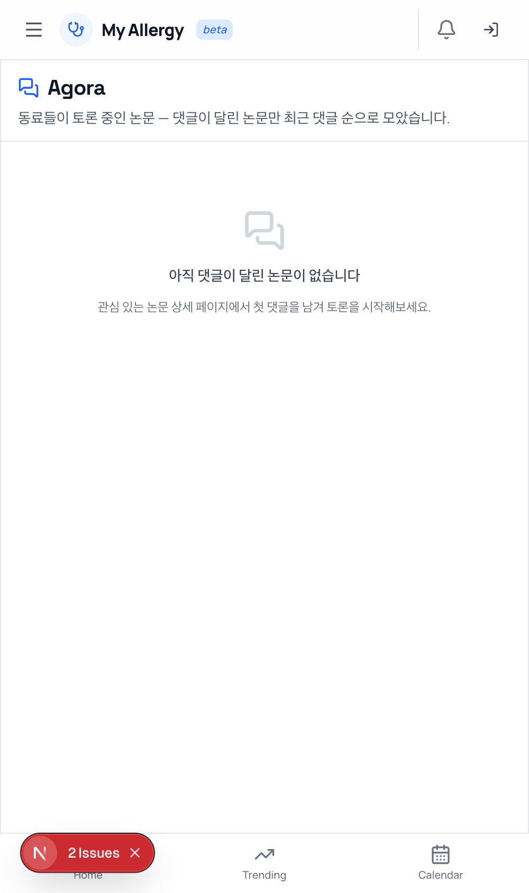

### 7.1 익명 ID

- 로그인 후 첫 댓글을 작성하면 `sha256(user_id + COMMUNITY_SALT)` 기반의 **익명 ID**가 생성됩니다.
- 같은 사용자는 항상 같은 익명 ID로 표시되므로 토론 일관성이 유지됩니다.
- 운영자도 실명을 역추적할 수 없도록 솔트 기반 단방향 해시를 사용합니다.

### 7.2 멘션과 알림

`@익명ID`를 입력하면 자동 완성 드롭다운이 나타납니다.

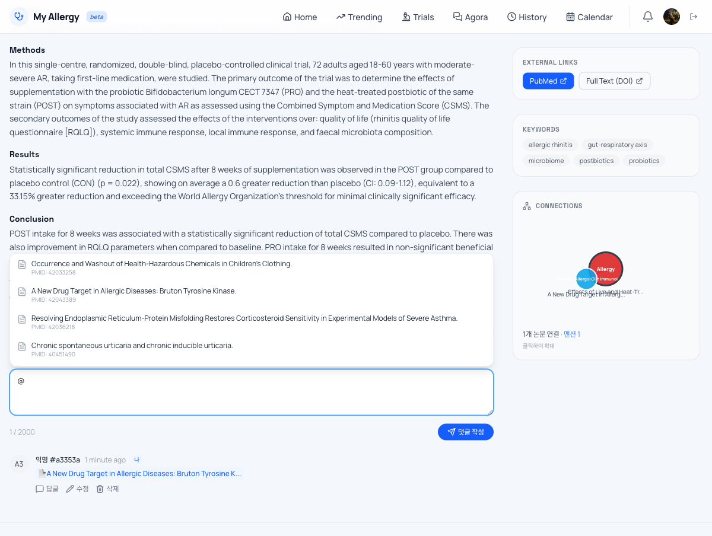

멘션되면 상대방에게 알림이 도착하고, 상단 헤더의 종 아이콘에 unread count가 표시됩니다.

### 7.3 규칙

- 환자 식별 정보(이름, 환자번호, 사진) 게시 금지
- 약품 광고·노골적 마케팅 금지
- 신고된 댓글은 관리자 검토 후 비공개 처리

---

## 8. 학회 캘린더 / 인사이트

### 8.1 학회 캘린더 (`/calendar`)

- 국제(KAAACI, EAACI, AAAAI, ACAAI, ATS, ERS 등) + 국내 학회 일정
- 매주 LLM 기반 웹 검색이 일정을 자동 점검하고, 운영자 승인을 거쳐 갱신됩니다 (review-gated)
- 다가오는 일정 / 지난 일정 토글로 과거 학회는 접어 두기

### 8.2 인사이트 (`/insights`)

- **First Author Geography**: 1저자 소속 국가를 세계지도에 표시
- **Author Leaders**: 최근 1년 발표 수 기준 저자 리더보드
- 저널·기간 필터 지원

---

## 9. 사용자 기능 (로그인 후)

로그인은 헤더 우측 "Sign in"을 클릭, 이메일 매직 링크로 진행됩니다.

### 9.1 북마크 (`/bookmarks`)

- 카드의 🔖 아이콘으로 즉시 저장
- 북마크 시 옵션으로 **AI 한국어 구조화 요약**을 같이 생성 (Background / Methods / Results / Implications)
- 요약은 `bookmarks.ai_summary` 컬럼에 캐싱 → 재방문 시 즉시 표시

### 9.2 맞춤 추천

사용자의 좋아요·북마크·체류 시간으로 **친화도(affinity) 프로필**이 누적되고, 다음 점수로 추천됩니다.

```
score = topic_weight × 0.6 + journal_weight × 0.3 + recency × 0.1
```

오른쪽 사이드바와 `/trending`의 "For you" 섹션에 반영됩니다.

### 9.3 설정 (`/settings`)

- 알림 토글 (멘션·답글)
- 친화도 프로필 초기화
- 다크모드 전환
- 데이터 삭제 요청

---

## 10. 모바일 사용 가이드

### 10.1 모바일 홈

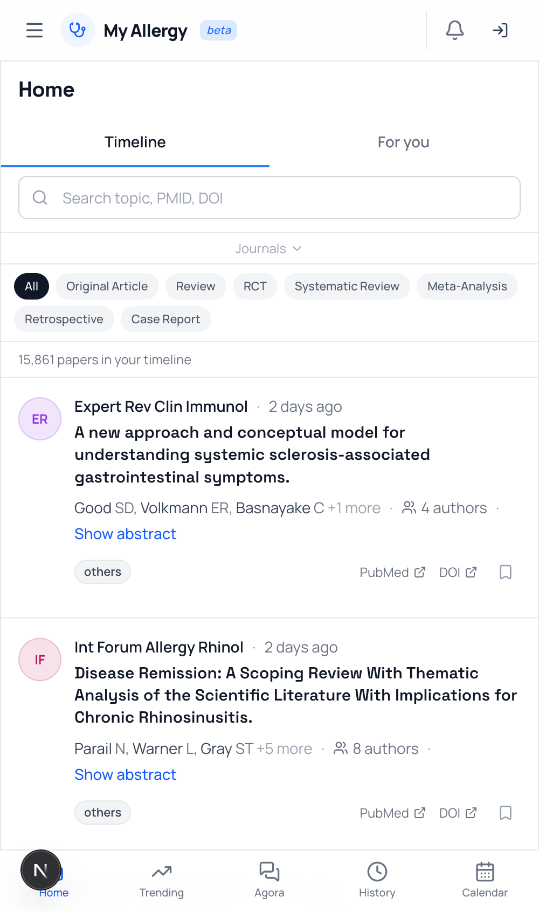

세로 카드 레이아웃으로 한 손 스크롤에 최적화돼 있습니다.

### 10.2 하단 네비게이션

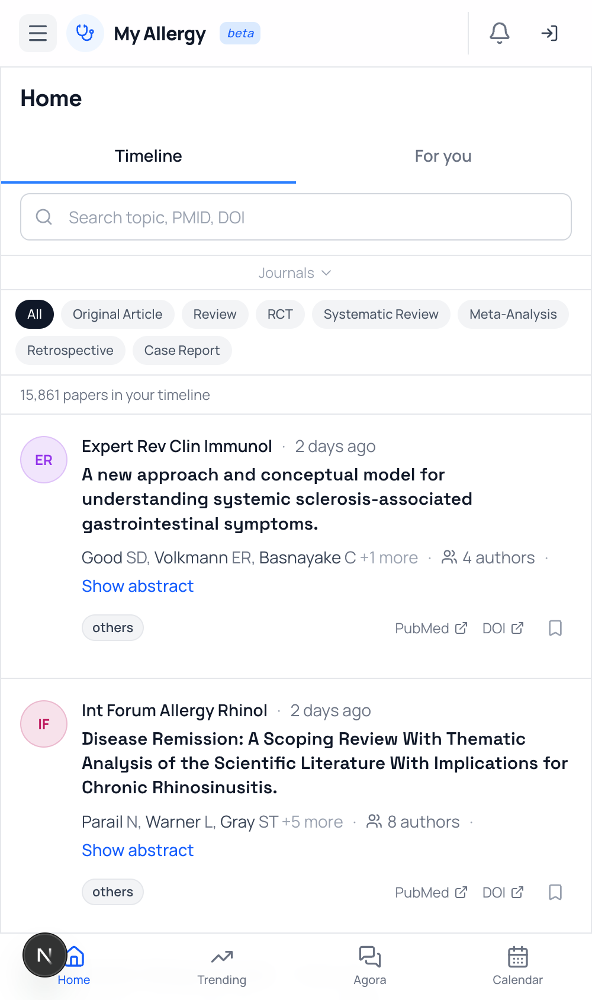

홈 / Trending / Trials / Agora / 메뉴 5개 탭이 항상 노출됩니다.

### 10.3 사이드 Drawer

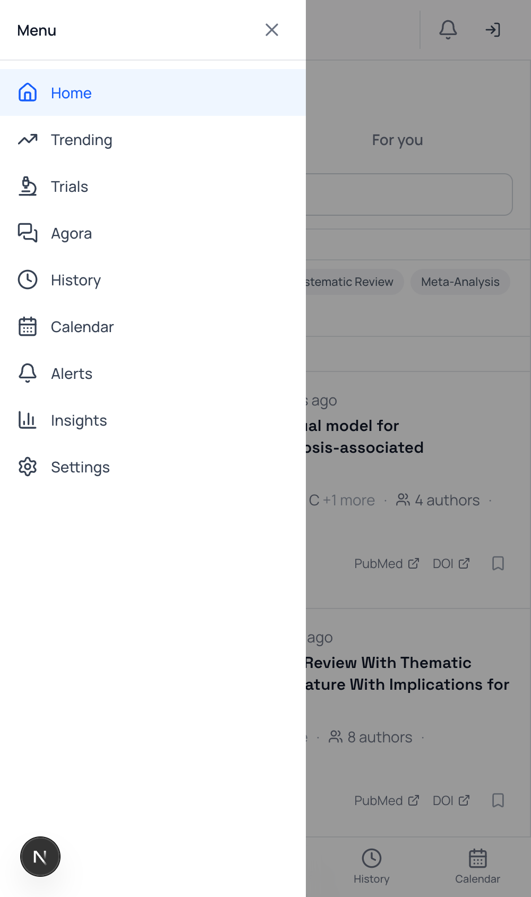

좌측 햄버거 메뉴를 열면 전체 메뉴(캘린더, 인사이트, 설정, 로그인)에 접근할 수 있습니다.

---

## 11. 자주 묻는 질문

**Q1. 논문이 늦게 올라옵니다.**
→ PubMed 자체 색인 지연이 일반적으로 1~7일 발생합니다. My Allergy는 매일 1회 동기화하므로, PubMed에 색인된 다음 날까지는 노출됩니다.

**Q2. 초록이 없는 논문은 왜 안 보이나요?**
→ 정책상 초록(abstract)이 있는 논문만 피드에 노출합니다. Letter·Editorial 등은 PubMed 링크로만 확인 가능합니다.

**Q3. AI 대화가 갑자기 차단됐어요.**
→ 하루 사용량(10논문 × 각 10회)을 초과한 경우입니다. UTC 자정에 리셋됩니다.

**Q4. 데이터 출처를 출판물에 인용하고 싶어요.**
→ 모든 메타데이터는 PubMed/CrossRef/ClinicalTrials.gov 원본에서 가져옵니다. 인용은 각 원본 데이터 제공자의 정책을 따르시고, My Allergy 자체는 큐레이션 서비스이므로 별도 인용은 불필요합니다.

**Q5. 새 저널이나 토픽을 추가하고 싶어요.**
→ [Issues](https://github.com/lekis1020/my-allergy/issues)에 ISSN과 함께 요청해 주세요. 저널은 알레르기 MeSH/tiab 필터를 적용해 검토 후 추가됩니다.

**Q6. 익명 ID가 변경될 수도 있나요?**
→ 운영상 `COMMUNITY_SALT`가 회전되면 기존 익명 ID가 무효화됩니다. 보안 이벤트가 아니면 회전하지 않습니다.

---

## 피드백 보내기

- 🐛 버그 / 기능 요청: [github.com/lekis1020/my-allergy/issues](https://github.com/lekis1020/my-allergy/issues)
- 📨 일반 피드백: 앱 내 "피드백" 메뉴 (`/api/feedback`)

읽어주셔서 감사합니다. My Allergy가 알레르기·면역학 진료와 연구에 작게나마 도움이 되길 바랍니다.
